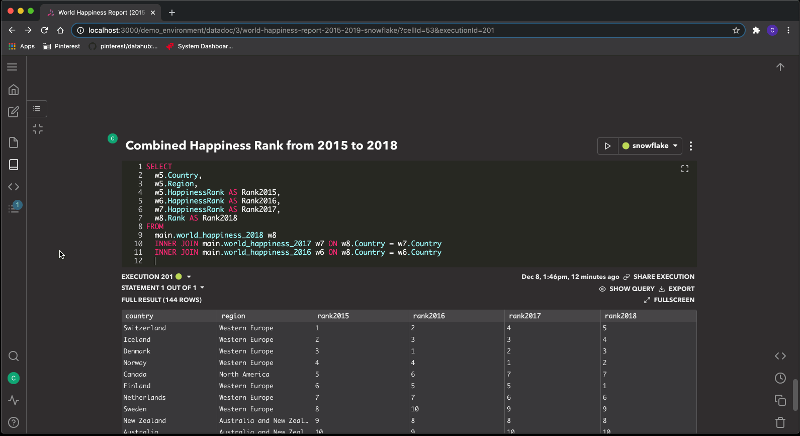
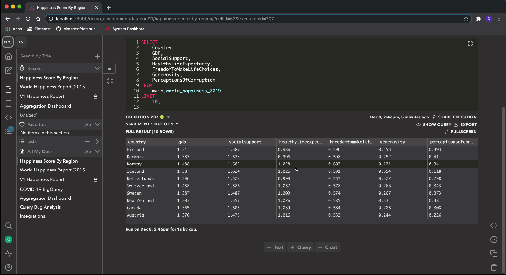
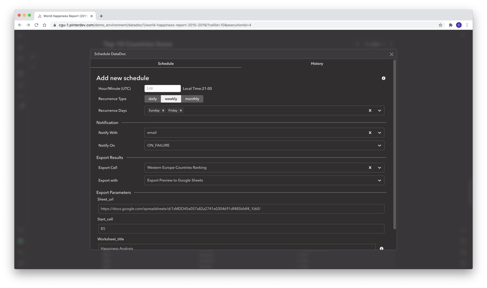
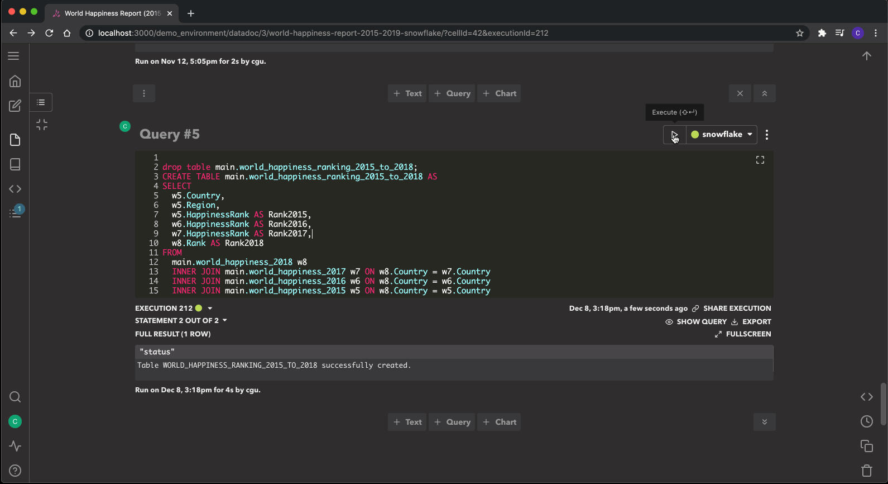

# Querybook

Querybook is a Big Data IDE that allows you to discover, create, and share data analyses, queries, and tables.
[Check out the full documentation & feature highlights here.](https://querybook.org)

# Features

-   📚 Organize **analyses** with rich text, queries, and charts
-   ✏️ Compose queries with **autocompletion** and hovering tooltip
-   📈 Use scheduling + charting in DataDocs to build **dashboards**
-   🙌 Live query **collaborations** with others
-   📝 Add additional **documentation** to your tables
-   🧮 Get lineage, sample queries, frequent user, search ranking based on **past query runs**

# Getting started

## Prerequisite

Please install Docker before trying out Querybook.

## Quick setup

Pull this repo and run `make`. Visit http://localhost:10001 when the build completes.

For more details on installation, [click here](docs_website/docs/setup_guide/overview.mdx)

## Configuration

For infrastructure configuration, [click here](docs_website/docs/configurations/infra_config.mdx)
For general configuration, [click here](docs_website/docs/configurations/general_config.mdx)

## Supported Integrations

### Query Engines

-   Presto
-   Hive
-   Druid
-   Snowflake
-   Big Query
-   MySQL
-   Sqlite
-   PostgreSQL
-   [and many more...](https://www.querybook.org/docs/setup_guide/connect_to_query_engines#all-query-engines)

### Authentication

-   User/Password
-   OAuth
    -   Google Cloud OAuth
    -   Okta OAuth
    -   GitHub OAuth
    -   Auth0 OAuth
-   LDAP

### Metastore

Can be used to fetch schema and table information for metadata enrichment.

-   Hive Metastore
-   Sqlalchemy Inspect
-   AWS Glue Data Catalog

### Result Storage

Use one of the following to store query results.

-   Database (MySQL, Postgres, etc)
-   S3
-   Google Cloud Storage
-   Local file

### Result Export

Upload query results from Querybook to other tools for further analyses.

-   Google Sheets Export
-   Python export

### Notification

Get notified upon completion of queries and DataDoc invitations via IM or email.

-   Email
-   Slack

# User Interface

Query Editor

Charting

Scheduling

Lineage & Analytics

# Contributing Back

See [CONTRIBUTING](CONTRIBUTING.md).
